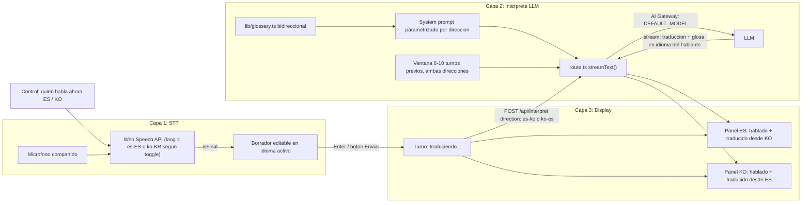

# Interprete ES<->KO en tiempo real (asistencia de texto en paralelo, bidireccional)

## Veredicto sobre `vercel.com/eve`
**No usar Eve.** Es un framework para agentes durables multi-turno con sandboxes, workflows persistentes y entrega multi-canal (Slack, cron, etc.) — resuelve un problema distinto al nuestro. Cada llamada a la capa intermedia sigue siendo una generación de un solo paso (sin loop de herramientas ni sandbox) — eso es lo que se quiso decir con "un solo turno", **no** que la conversación sea unidireccional. La conversación de la reunión sí es bidireccional (ES->KO y KO->ES); la arquitectura correcta sigue siendo un route handler de Next.js que llama `streamText` vía AI Gateway, parametrizado por dirección, sin capa de agente encima.

## Stack validado
- Next.js 16 (App Router), TypeScript, Tailwind CSS, npm.
- `ai@^6` — `streamText({ model: 'anthropic/claude-sonnet-4.6', ... })` enruta automáticamente por el AI Gateway (string `provider/model`, sin necesidad de `gateway()` wrapper).
- Auth del Gateway: OIDC vía `vercel link` + `vercel env pull` (ya tienes cuenta Vercel) — sin gestionar API keys manualmente.
- Modelo activo seleccionable por variable de entorno `DEFAULT_MODEL` (cambio de 1 línea en `.env.local`, sin tocar código, usado para ambas direcciones). Antes de fijar el default, se valida la lista real de slugs disponibles vía `gateway.getAvailableModels()` (no confiar en memoria de los 3 candidatos).

## Plantilla elegida: shadcn CLI v4 (Next.js + Tailwind + shadcn en un solo comando)
Investigado contra la documentación actual de shadcn (CLI v4, marzo 2026): el comando `shadcn init -t next` ya scaffoldea un proyecto Next.js completo con Tailwind, dark mode y shadcn configurado — **no hace falta `create-next-app` por separado**. No existe una "plantilla Vercel" adicional que agregar: Next.js desplegado vía Vercel CLI/dashboard ya es el camino nativo. Esta es la única plantilla necesaria; no se requieren plantillas complementarias.

### Fase 0 — Scaffold del proyecto (ejecutas tú, en tu terminal)

```bash
# 1. Crear el proyecto: Next.js + TypeScript + Tailwind + shadcn + dark mode, todo en uno
npx shadcn@latest init -t next -d -n interprete-es-ko

# 2. Entrar al proyecto
cd interprete-es-ko

# 3. Verificación rápida de que el scaffold corre (Ctrl+C para detener despues de ver "Ready")
npm run dev

# 4. Agregar los componentes shadcn que usaremos en la UI
npx shadcn@latest add button card textarea badge switch separator scroll-area skeleton tooltip

# 5. Instalar el AI SDK (capa 2)
npm install ai
```

Verificación esperada: existe `components.json`, `app/layout.tsx`, `app/globals.css`, `components/ui/` con los componentes instalados, y `package.json` incluye `ai`.

### Fase 1 — Vínculo con Vercel + AI Gateway (ejecutas tú; requiere tu cuenta/equipo Vercel)

```bash
# 6. CLI de Vercel (si no la tienes global)
npm i -g vercel

# 7. Login (abre el navegador)
vercel login

# 8. Vincular este folder a un proyecto Vercel (elige tu team/proyecto o crea uno nuevo)
vercel link
```

**PAUSA MANUAL — acción solo en el dashboard de Vercel (no hay comando CLI para esto):**
Ir a `https://vercel.com/{tu-team}/{tu-proyecto}/settings` → **AI Gateway** → habilitarlo para el proyecto. Sin este paso, `vercel env pull` no provisionará el `VERCEL_OIDC_TOKEN` con permisos de Gateway.

```bash
# 9. Traer el token OIDC al entorno local (despues de habilitar AI Gateway arriba)
vercel env pull .env.local
```

```bash
# 10. Agregar el modelo activo (no es secreto, va en .env trackeado por git, no en .env.local)
echo 'DEFAULT_MODEL=anthropic/claude-sonnet-4.6' >> .env
```

Verificación esperada: `.env.local` contiene `VERCEL_OIDC_TOKEN=...`, `.env` contiene `DEFAULT_MODEL=...`, `vercel whoami` y `cat .vercel/project.json` confirman el proyecto correcto.

Después de estas dos fases, el repo queda listo para que yo empiece a escribir código (route handler, prompt, hooks, UI) sobre esta base.

## Decisiones de diseño confirmadas (resumen de la entrevista)
- **Comunicación bidireccional**: ES->KO y KO->ES, con el mismo enfoque de "detectar intención y colapsar redundancia" en ambas direcciones (trato simétrico — se ajustará con datos reales si el habla coreana resulta ser más directa de entrada).
- **Captura de voz**: un solo dispositivo/pantalla compartida en la mesa, con un control de alternancia ("¿quién habla ahora? ES / KO") que cambia el idioma activo del reconocimiento de voz. No hay detección automática de idioma ni dos streams paralelos.
- **Contexto entre turnos**: ventana corta — últimos 6-10 turnos (de ambas direcciones) incluidos en cada llamada, para consistencia terminológica y resolución de referencias.
- **Cambio de modelo**: vía `DEFAULT_MODEL` en `.env.local`.
- **Flujo de corrección**: confirmación manual por turno, en cualquier dirección. El STT marca fin de frase (`isFinal`); el texto aparece editable en el idioma activo y se envía al LLM solo al pulsar Enter/botón. El reconocimiento sigue escuchando en segundo plano, así que los turnos pendientes se gestionan como una cola.
- **Glosario**: estructura única y bidireccional (`lib/glossary.ts`) con categorías (procedimientos estéticos, finanzas/negocio, marcas) y 5-10 términos de ejemplo; el equipo lo completa después. Las parejas `es <-> ko` sirven para ambas direcciones de traducción.
- **Verificación de calidad (simétrica)**: cada turno traducido viene acompañado de una glosa breve en el idioma de quien habló — si habló en ES, la glosa de verificación es en ES (para que el equipo confirme qué le va a llegar al cliente en coreano); si habló en KO, la glosa es en KO (para que la contraparte confirme qué le va a llegar al equipo en español). Generada en la misma llamada, sin segunda pasada.
- **Historial**: persistido en `localStorage` del navegador (sobrevive a un refresh accidental durante la reunión), descartable con un botón "Nueva sesión".

## Arquitectura



## Estructura de archivos a crear

- [app/api/interpret/route.ts](app/api/interpret/route.ts) — `POST`, recibe `{ text, direction: 'es-ko' | 'ko-es', history }`, construye el prompt con glosario + ventana de contexto según dirección, llama `streamText`, responde con `toTextStreamResponse()`.
- [lib/system-prompt.ts](lib/system-prompt.ts) — `buildSystemPrompt(direction)`: intención > literalidad, colapso de redundancia, registro de negocios formal en el idioma destino, glosario inyectado (orientado a la dirección activa), marcas en inglés, preservar cifras/montos/plazos exactos, formato de salida delimitado `traduccion` / `glosa` (glosa siempre en el idioma de origen del hablante).
- [lib/glossary.ts](lib/glossary.ts) — categorías `procedimientos`, `finanzas`, `marcas`, cada entrada `{ es, ko, nota? }`; helper `buildGlossaryBlock(direction)` para inyectar como texto en el prompt.
- [lib/types.ts](lib/types.ts) — `Turn { id, direction: 'es-ko' | 'ko-es', original, translated, gloss, status: 'pending' | 'translating' | 'done' | 'error', timestamp }`.
- [hooks/useSpeechRecognition.ts](hooks/useSpeechRecognition.ts) — wrapper de `SpeechRecognition`/`webkitSpeechRecognition`, `continuous: true`, `interimResults: true`, `lang` dinámico (`es-ES` o `ko-KR` según el control de alternancia activo, reinicia el reconocimiento al cambiar), expone cola de borradores y métodos `editDraft`/`confirmDraft`/`discardDraft`.
- [components/DirectionToggle.tsx](components/DirectionToggle.tsx) — control visible "¿Quién habla? ES / KO" que cambia el idioma activo de captura y la dirección de traducción del próximo borrador.
- [components/SpanishPanel.tsx](components/SpanishPanel.tsx) — turnos hablados en ES (borradores editables + historial) y turnos traducidos desde KO, en orden cronológico unificado.
- [components/KoreanPanel.tsx](components/KoreanPanel.tsx) — turnos hablados en KO y turnos traducidos desde ES, texto grande en streaming + glosa pequeña debajo de cada turno.
- [app/page.tsx](app/page.tsx) — layout de dos paneles + `DirectionToggle`, maneja estado de turnos (incluye persistencia en `localStorage`), pasa ventana de historial bidireccional a las llamadas API.
- [.env.local.example](.env.local.example) — `DEFAULT_MODEL=anthropic/claude-sonnet-4.6`, comentario sobre OIDC vs `AI_GATEWAY_API_KEY`.

## Formato de salida del LLM
Texto delimitado simple en streaming (más robusto que JSON parcial para baja latencia): el modelo emite primero la traducción (en el idioma destino), luego un separador fijo (`\n---\n`), luego la glosa en el idioma de origen del hablante. El cliente muestra todo antes del separador como traducción (creciendo en vivo) y lo que sigue como glosa. Se evalúa durante la implementación si conviene migrar a `Output.object()` estructurado de AI SDK v6 si el delimitador resulta frágil en pruebas reales.

## Metodología de implementación: SDD paso a paso, con pausas
Una vez completadas las Fases 0 y 1 (scaffold + Vercel, arriba — las ejecutas tú), la implementación del código procede con Spec-Driven Development: por cada fase se genera/actualiza la spec y la lista de tareas, se implementa tarea por tarea, y se verifica antes de pasar a la siguiente. Me detengo y espero tu confirmación en cada **PAUSA** marcada abajo — no continúo automáticamente cuando la tarea requiere algo de tu lado (credenciales, decisiones de contenido, validación manual en el navegador).

## Orden de implementación (siguiendo tu secuencia, ajustado a bidireccional)

**Fase 0 — Scaffold** (manual, ver arriba) → **Fase 1 — Vercel/Gateway link** (manual, ver arriba) →

**Fase 2 — Esqueleto `/api/interpret`**
- Crear `/api/interpret/route.ts` con `streamText` de prueba (eco simple) aceptando ya `{ text, direction, history }`.
- **PAUSA**: te pido correr `npm run dev` y confirmar que el endpoint responde (o lo verifico yo si me das permiso de ejecutar comandos no destructivos como `curl localhost:3000/api/interpret`).

**Fase 3 — System prompt + glosario**
- Escribir `lib/system-prompt.ts` (parametrizado por dirección) + `lib/glossary.ts` (placeholder bidireccional con procedimientos/finanzas/marcas de ejemplo).
- Probar ambas direcciones con frases de ejemplo contra el endpoint real (ya usando `DEFAULT_MODEL` vía Gateway).
- **PAUSA**: te muestro 2-3 ejemplos de salida real (ES->KO y KO->ES) para que valides calidad/tono antes de seguir. Esta es también tu oportunidad de pasarme tus términos reales de glosario si quieres reemplazar los placeholders ahora.

**Fase 4 — Captura de voz**
- Implementar `useSpeechRecognition` (idioma dinámico según `DirectionToggle`, segmentación por `isFinal`, cola de borradores editables) + el componente `DirectionToggle`.
- **PAUSA**: el Web Speech API requiere permiso de micrófono en el navegador y solo funciona bien en Chrome/Edge — te pido probarlo en tu máquina (yo no tengo acceso a tu micrófono) y confirmar que la transcripción ES/KO funciona antes de conectar la UI completa.

**Fase 5 — UI de dos paneles**
- Construir `SpanishPanel` + `KoreanPanel` + `app/page.tsx` (dos columnas, texto grande, historial unificado persistido en `localStorage`, glosa de verificación simétrica), usando los componentes shadcn ya instalados en la Fase 0.
- **PAUSA final**: revisión visual conjunta antes de considerar el MVP listo para una reunión real.

## Fuera de alcance para este MVP (documentado, no implementado)
- Backend Whisper (capa STT de producción) — se deja como reemplazo futuro de `useSpeechRecognition`, misma interfaz de "turno confirmado" hacia la capa 2, en ambas direcciones.
- Dos dispositivos/pantallas simultáneas o detección automática de idioma (se eligió un solo dispositivo con alternancia manual).
- Multi-hablante / multi-micrófono dentro de un mismo idioma.
- Migración de auth a `AI_GATEWAY_API_KEY` estático (solo si se despliega fuera de Vercel).
